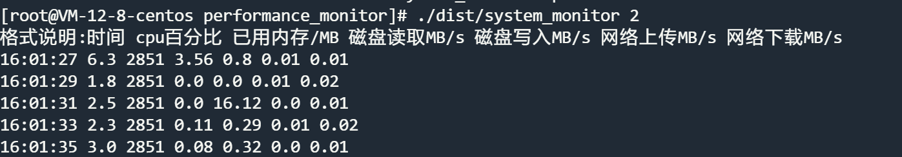

# performance_monitor
psutil based performance testing tool for windows and linux

Can monitor [' CPU percentage ', 'has been in memory/MB', 'read disk MB/s',' the disk write MB/s', 'network upload MB/s',' Internet downloads MB/s]

```bash
pyinstaller -n system_monitor -F -i "C:\Users\Franciz\Pictures\我的照片\performance_monitor.ico" .\system_monitor.py --distpath=E:\WORK\测试升级工具
```

# 使用说明

软件资源占用非常小几乎可以忽略不计,记录的数据是实时写入的--即使关闭了程序历史记录也存在.

启动软件默认10s记录并写入一次`当前系统日期MonitorInfo.csv` 文件存在于软件所在目录

可以使用命令行传参

例如每2s记录一次

```bash
system_monitor.exe 2
```

	

cpu百分比:所有的cpu的平均利用率,此处和windows的任务管理器中查看的是不一致的,但是和性能监视器的结果一致.


## 性能检测结果演示

| 时间     | cpu百分比 | 已用内存/MB | 磁盘读取MB/s | 磁盘写入MB/s | 网络上传MB/s | 网络下载MB/s |
| -------- | --------- | ----------- | ------------ | ------------ | ------------ | ------------ |
| 15:55:15 | 1.1       | 28998       | 0.39         | 4.6          | 0            | 0            |
| 15:55:17 | 0.7       | 28998       | 0            | 0.21         | 0            | 0            |
| 15:55:19 | 1.2       | 28992       | 0            | 0.56         | 0            | 0.01         |
| 15:55:21 | 0.9       | 29261       | 0.02         | 0.87         | 0            | 0.01         |
| 15:55:23 | 0.5       | 29147       | 0            | 0.09         | 0            | 0            |


## 支持Linux

	

使用方法

```shell
./system_monitor
```

