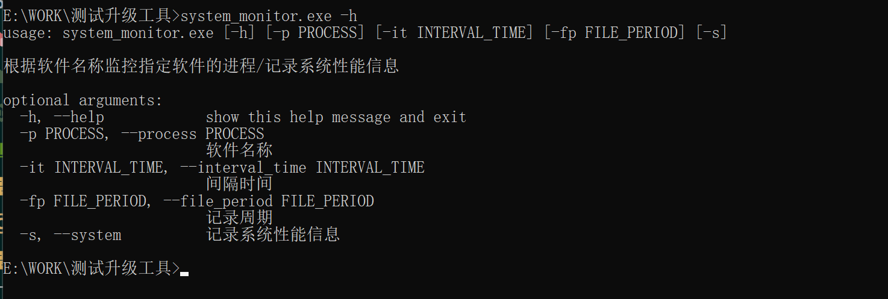
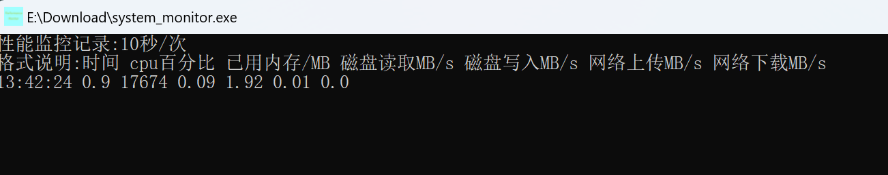

# performance_monitor

基于psutil开发的Windows和Linux性能测试工具

可以监控['cpu百分比', '已用内存/MB', '磁盘读取MB/s', '磁盘写入MB/s', '网络上传MB/s', '网络下载MB/s']

## 简介

软件资源占用非常小几乎可以忽略不计,记录的数据是实时写入的--即使关闭了程序,历史记录也存在.

启动软件默认10s记录并写入一次`当前系统日期MonitorInfo.csv` 文件存在于软件所在目录

可以使用命令行传参,查看帮助 -h


## 参数列表

| 命令 | 释义                              |
| ---- | --------------------------------- |
| -p   | 软件的名称                        |
| -s   | 启动监控系统性能,不可与-p同时使用 |
| -it  | 记录的间隔时间/秒                 |
| -fp  | 记录的文件写入周期/天             |
| -d   | 是否记录所有进程的名字            |

## windows系统中监控系统性能

例如每2s记录一次

```bash
system_monitor.exe -it 2
```



cpu百分比:所有的cpu的平均利用率,此处和windows的任务管理器中查看的是不一致的,但是和性能监视器的结果一致.

## 性能检测结果演示

| 时间       | cpu百分比 | 已用内存/MB | 磁盘读取MB/s | 磁盘写入MB/s | 网络上传MB/s | 网络下载MB/s |
|----------|--------|---------|----------|----------|----------|----------|
| 15:55:15 | 1.1    | 28998   | 0.39     | 4.6      | 0        | 0        |
| 15:55:17 | 0.7    | 28998   | 0        | 0.21     | 0        | 0        |
| 15:55:19 | 1.2    | 28992   | 0        | 0.56     | 0        | 0.01     |
| 15:55:21 | 0.9    | 29261   | 0.02     | 0.87     | 0        | 0.01     |
| 15:55:23 | 0.5    | 29147   | 0        | 0.09     | 0        | 0        |

## windows系统中监控指定包含软件名称的进程的性能

例如监控windows上的`java.exe`

```bash
system_monitor.exe -p java.exe
```


设置文件写入周期7天/次,监控周期60秒/次

```bash
system_monitor.exe -p java.exe -it 60 -fp 7
```

## 支持Linux


使用方法同windows

```shell
./linux_system_monitor
```

