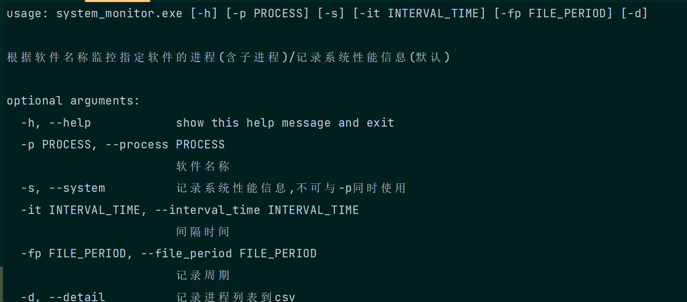
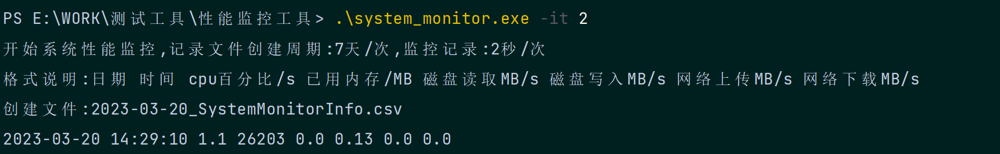
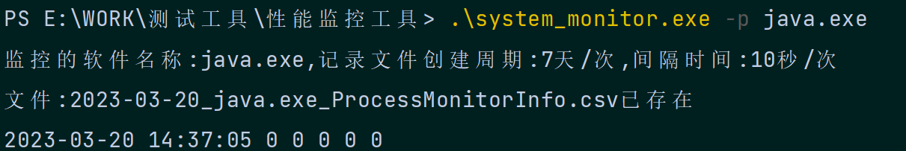
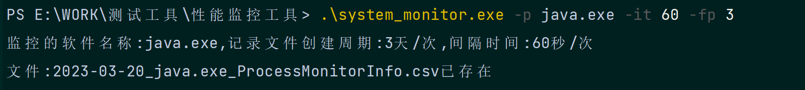
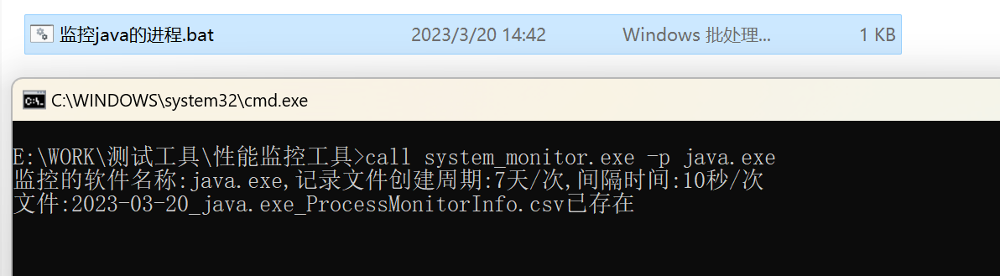

# performance_monitor

基于psutil开发的Windows和Linux性能测试工具

可以监控['cpu百分比', '已用内存/MB', '磁盘读取MB/s', '磁盘写入MB/s', '网络上传MB/s', '网络下载MB/s']

## 简介

软件资源占用非常小几乎可以忽略不计,记录的数据是实时写入的--即使关闭了程序,历史记录也存在.

启动软件默认10s记录`系统性能`并写入一次`当前系统日期_MonitorInfo.csv` 文件存在于软件所在目录

	

可以使用命令行传参,查看帮助 -h


### 注意事项

如果进程是由管理员/最高权限启动,那么监控工具也需要用对应权限启动.
若监控的进程数量较多,在设置监控间隔时间较短(比如小于5s)可能会无法实现,因为监控较多进程时程序本身需要4s左右(基于监控50个进程)的时间计算.


## 参数列表

| 命令  | 释义                                                         |
| ----- | ------------------------------------------------------------ |
| -s    | 启动监控系统性能(无参时默认启动),不可与-p同时使用,两者暂时不可同时使用 |
| -p    | 软件的名称                                                   |
| -port | 软件对应的端口号                                             |
| -it   | 记录的间隔时间/秒(默认10秒)                                  |
| -fp   | 记录的文件写入周期/天(默认7天)                               |
| -d    | 是否记录所有进程的名字(默认关闭)                             |

## 进程存活的解释

当前判断进程存活的状态为:运行中/休眠

## windows

### 监控系统性能

例如每2s记录一次

```bash
monitx.exe -it 2
```

	

例如每2s记录一次,记录文件创建周期:3天/次


cpu百分比:所有的cpu的平均利用率,此处和windows的任务管理器中查看的是不一致的,但是和性能监视器的结果一致.

### 监控系统性能检测结果演示

| 日期       | 时间     | cpu百分比 | 已用内存/MB | 磁盘读取MB/s | 磁盘写入MB/s | 网络上传MB/s | 网络下载MB/s |
| ---------- | -------- | --------- | ----------- | ------------ | ------------ | ------------ | ------------ |
| 2023-03-20 | 15:55:15 | 1.1       | 28998       | 0.39         | 4.6          | 0            | 0            |
| 2023-03-20 | 15:55:17 | 0.7       | 28998       | 0            | 0.21         | 0            | 0            |
| 2023-03-20 | 15:55:19 | 1.2       | 28992       | 0            | 0.56         | 0            | 0.01         |
| 2023-03-20 | 15:55:21 | 0.9       | 29261       | 0.02         | 0.87         | 0            | 0.01         |
| 2023-03-20 | 15:55:23 | 0.5       | 29147       | 0            | 0.09         | 0            | 0            |

### 监控指定包含软件名称的进程的性能

例如监控windows上的`java.exe`

```bash
monitx.exe -p java.exe
```

		

设置文件写入周期7天/次,监控周期60秒/次

```bash
monitx.exe -p java.exe -it 60 -fp 7
```

	

### 监控指定包含软件名称的进程的性能检测结果演示

正向结果-软件的进程存活

| 日期      | 时间     | cpu百分比/s | 已用内存/MB | 已用内存百分比 | 进程数/个 | 状态(1存活,0死亡) |
| --------- | -------- | ----------- | ----------- | -------------- | --------- |-------------|
| 2023/3/17 | 16:46:33 | 0           | 769.54      | 2.13           | 16        | 1           |
| 2023/3/17 | 16:46:43 | 1.5         | 769.54      | 2.13           | 16        | 1           |
| 2023/3/17 | 16:46:54 | 1.6         | 769.54      | 2.13           | 16        | 1           |
| 2023/3/17 | 16:47:04 | 0           | 769.54      | 2.13           | 16        | 1           |
| 2023/3/17 | 16:47:14 | 0           | 770.04      | 2.13           | 16        | 1           |

反向结果-软件的进程死亡

| 日期      | 时间     | cpu百分比/s | 已用内存/MB | 已用内存百分比 | 进程数/个 | 状态(1存活,0死亡) |
| --------- | -------- | ----------- | ----------- | -------------- | --------- | ------------- |
| 2023/3/18 | 21:05:01 | 0           | 0           | 0              | 0         | 0             |
| 2023/3/18 | 21:05:12 | 0           | 0           | 0              | 0         | 0             |
| 2023/3/18 | 21:05:23 | 0           | 0           | 0              | 0         | 0             |
| 2023/3/18 | 21:05:34 | 0           | 0           | 0              | 0         | 0             |


## Linux

### 监控系统性能

示例:监控系统性能

```shell
monitx
```

		

### 监控包含指定名称的进程的性能

示例:监控进程名包含`frp`的所有进程的性能信息,2s/次

```
monitx -p frp -it 2
```

		


## 使用技巧

因为支持命令行传参所以你可以自用的使用shell脚本或者bat脚本来完成指定的场景.

例如: windows下`call monitx.exe -p java.exe`

	
